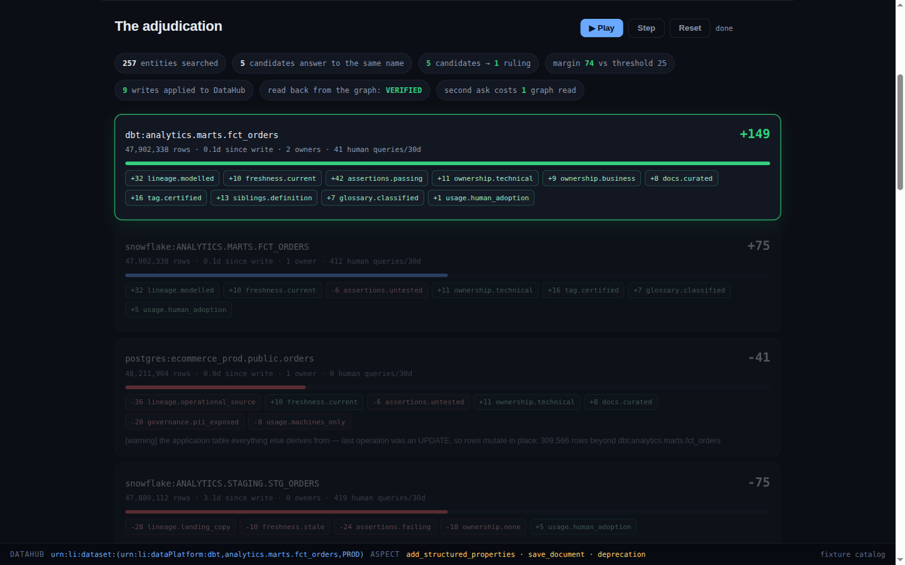

# canon

**It's Friday, 4:55 PM. Can I send this number to the board?**

Five tables in this catalog answer to `orders`. The number in the deck came from
one of them. canon works out which one is actually canonical — from lineage,
freshness, ownership, assertions, governance signals and DataHub's own siblings
aspect — writes the ruling back into DataHub, and retires the impostor so nobody
has to ask again.

```
the number in the deck     $7,951,811.55     from ANALYTICS.STAGING.STG_ORDERS
what it actually is        $7,121,844.95     from ANALYTICS.MARTS.FCT_ORDERS
                           ─────────────
                             $829,966.60     11.65% overstated
```

No. It came from the wrong table.



Both figures are `SELECT`s against a DuckDB warehouse built from a fixed seed —
not an estimate. The staging copy is three days behind, includes 518 internal
test orders, and never nets off $334,160.03 of refunds.

---

## Try it in thirty seconds

```bash
npm install
npm run demo          # no credentials, no DataHub, no API key
```

That writes `out/index.html` — a self-contained page with the whole run in it.
[`examples/report.html`](examples/report.html) is a committed copy if you would
rather not run anything.

```bash
npm run poison        # break the winner on purpose; watch the ruling move
npm run eval          # the ablation, and 24 scenarios nobody hand-wrote
npm test              # 24 tests
npm run rules         # the 22 weighted rules, printed from the array that runs
```

Those four are Node only. The dollar figure needs Python, because it is a real
warehouse query rather than a constant:

```bash
pyenv shell .datahub-hack && poetry install    # once
npm run price                                  # the two SELECTs behind the numbers above
```

`npm run demo` calls it too, and degrades gracefully — with no Python
environment the report renders without the pricing section rather than
substituting a number.

Against a live DataHub OSS quickstart, see [RUNNING-LIVE.md](RUNNING-LIVE.md).

---

## The mechanism: duplicates versus different definitions

This is the whole product, so it runs before anything else and it is
deterministic.

Two assets that both answer to "revenue" are one of two things.

**Duplicates** — the same business fact materialised more than once: a landing
copy, a modelled table, a warehouse sibling, a frozen snapshot. They share a
grain and their measure semantics are compatible. Exactly one of them should be
cited, so a catalog *can* pick a winner. canon rules.

**Different definitions** — genuinely different business facts that share a
word. Finance's *recognised revenue, net of refunds, excluding shipping* and
Growth's *gross bookings including shipping* have the same grain and the same
ancestor, but `recognised_revenue_usd` and `gross_bookings_usd` declare
different measure semantics. Both are correct. No amount of lineage, freshness
or ownership metadata can choose between them, because the disagreement is
organisational. **canon ABSTAINS** and files the question, inside DataHub, to
the owners who can settle it.

Ruling on a different-definitions pair is the worst failure available to this
product: it launders a disagreement into a fact. So the partition gates the
scorer, not the other way round.
([`src/agent/cohort.ts`](src/agent/cohort.ts))

## The ruling is computed, not written by a model

The decision comes from a table of 22 named, signed, weighted rules over real
DataHub aspects — exported as data so the weights you read are the weights that
ran ([`src/agent/rules.ts`](src/agent/rules.ts)). **No language model is
involved in the decision on any path**, with or without an API key.

A model's only job is to write the ruling up afterwards, and it is given the
decision rather than asked for one — it can change the prose and nothing else
([`src/agent/narrate.ts`](src/agent/narrate.ts)).

Popularity is worth almost nothing on purpose: `usage.human_adoption` caps at
+6 while one passing assertion is worth +14. That asymmetry is the argument
expressed as arithmetic. The table four analysts query every week is evidence of
a live problem, not evidence that it is canonical — and on the demo catalog, it
is exactly what put the wrong number in the deck.

Three consequences, each with a command:

| | |
|---|---|
| **It can be falsified.** `npm run poison` deprecates the winner, strips its owners and fails its assertions. The ruling moves from `dbt:analytics.marts.fct_orders` (149) to its warehouse sibling (75), and the poisoned table drops to −89 with the three rules that did it printed underneath. The script exits non-zero if the ruling does *not* move. | `npm run poison` |
| **It can be evaluated.** 24 generated scenarios with ground truth fixed at construction. | `npm run eval` |
| **It reproduces.** Same catalog, byte-identical ruling, every run. That is what makes the falsification demo safe to do on camera. | `npm test` |

## What it writes back, and what it refuses to

Criterion one asks projects to contribute back to the graph. canon does, and the
scoping is the interesting part.

| Write | Where it lands | Transport |
|---|---|---|
| `canon.status`, `canon.subject`, `canon.decided_at`, `canon.rationale` on the winner | structured properties | `mcp:add_structured_properties` |
| `canon.superseded_by` on every loser | structured properties | `mcp:add_structured_properties` |
| The full evidence trail | a native DataHub Document, type `Decision`, related to every candidate | `mcp:save_document` |
| Deprecation — **on exactly one asset** | `deprecation` aspect | Python SDK |
| On ABSTAIN: the unanswerable question | a native DataHub Incident assigned to the named owners | Python SDK |
| On ABSTAIN: a ruling canon can no longer stand behind | retracted — the `canon.*` claim is removed | `mcp:remove_structured_properties` |

Every claim is **question-scoped**. `canon.status = canonical` is always paired
with `canon.subject`, because an asset is canonical *for a question*, never in
the abstract.

**Only one asset is ever deprecated, and the test for it is narrow**
([`isTrulyDead`](src/agent/score.ts)): reached by a `COPY` edge, stale or
failing freshness, no business owner, every direct consumer inside this same
question, and not already deprecated. On the demo catalog that is
`ANALYTICS.STAGING.STG_ORDERS` and nothing else. The raw operational table
scores −41 and is still only a warning — deprecating the table the checkout
service writes to would be false metadata, and a losing rival definition is not
ours to retire.

Nothing is written without approval. canon plans; applying is a separate call
that takes the plan the operator already read. In the report, that is a button:
the plan is shown with the one consequential line marked, and one click applies
it.

**And it can take a claim back.** If canon ruled on a subject once and now
abstains — because a second definition appeared, or the catalog moved under it —
leaving the old marker would be worse than never having ruled, so abstaining
retracts it.

## The catalog gets smarter, not just canon

```bash
npm run ask-once
```

That opens the plain DataHub OSS MCP server with mutation tools **off** and
imports none of canon's code — no rules, no scorer, no resolver. It is a
stand-in for the next agent that wanders in.

```
-> dbt:analytics.marts.fct_orders
     canon.status = canonical  (for "customer orders")
xx snowflake:ANALYTICS.STAGING.STG_ORDERS
     DEPRECATED by canon: Not canonical for "customer orders".
     Use dbt:analytics.marts.fct_orders instead.
```

It distinguishes what canon deprecated from what was already deprecated before
it ran. Committed output: [`examples/ask-once.txt`](examples/ask-once.txt).

## Evaluation

**The ablation.** One question, one catalog, four strategies. Three of them are
what real tools do today, and they pick three *different* wrong tables:

| | picks | |
|---|---|---|
| **canon** | `dbt:analytics.marts.fct_orders` | correct |
| top-search-hit | `snowflake:ANALYTICS.STAGING.stg_purchase_orders` | wrong — a different noun |
| freshest | `postgres:ecommerce_prod.public.orders` | wrong — the operational table |
| most-queried-by-humans | `snowflake:ANALYTICS.STAGING.STG_ORDERS` | wrong — and this is the one the analyst used |

**The un-stacked eval.** Because "your fixture was written by the same person
who wrote your adjudicator" is a fair objection.
[`src/eval/scenarios.ts`](src/eval/scenarios.ts) generates catalogs from a seeded
PRNG, fixes ground truth at construction, and builds about a third of them to
have *no right answer* — so an adjudicator that always answers scores badly.

```
seed 20260805, n = 24
correct pick      12/12
correct abstain   11/12
false confidence  1      ruled on a question that has no answer
over-abstention   0
```

That one miss is written up in full, including why it was not fixed, in
[`eval/README.md`](eval/README.md). CI reruns this exact draw and asserts these
exact counts — a threshold would let the numbers drift under a green build.

Other draws: seed 99 n=40 → 40/40; seed 7 n=40 → 40/40. The reference seed is
the one *with* the miss.

## How it uses DataHub

Reads and OSS-legal writes go over the MCP server. Two writes have no OSS MCP
tool at all, and rather than pretend otherwise they go through the Python SDK
against the same GMS.

- **MCP** (`acryldata/mcp-server-datahub`): `search`, `get_entities`,
  `get_lineage`, `get_dataset_queries`, `add_structured_properties`,
  `save_document`.
- **DataHub OSS aspect API** (`/openapi/v3/entity/dataset/{urn}`) for
  `upstreamLineage` (canon needs the edge *type* — `COPY` vs `TRANSFORMED` is
  the difference between a landing copy and a modelled table), `siblings`,
  `operation`, `datasetProfile`, `datasetUsageStatistics`. MCP's `get_entities`
  does not return these.
- **Python SDK** for the `deprecation` aspect and for `incidentInfo`.

`set_deprecation` is **DataHub Cloud only**, as are the proposal and lifecycle
tools. canon claims none of them. Rather than assert that, it prints it:

```bash
npm run mcp:probe
```

against a running quickstart, which enumerates the tools the server actually
registers and confirms the Cloud-only ones are absent. Committed output:
[`examples/mcp-tools.txt`](examples/mcp-tools.txt).

## Honest limits

- **The demo catalog is hand-authored.** 257 entities in DataHub's real aspect
  shapes, not a capture of a production instance. The un-stacked eval exists
  because of this, not in spite of it.
- **Live mode sees aggregate assertion health, not per-assertion results.** The
  OSS MCP server exposes no per-assertion read, so live mode collapses them to
  one synthetic assertion carrying DataHub's own PASS/FAIL verdict, and labels
  it. Same winner, same ordering, smaller numbers (102 vs 52 live, 149 vs 75 on
  fixtures).
- **The measure-semantics lexicon is small and explicit.** GROSS, NET, REFUND,
  TAX, SHIPPING, COUNT. An unrecognised measure contributes no marker rather
  than a guessed one, so the partition fails towards "duplicate" — abstaining is
  cheap to claim and hard to check, and the mechanism must not reach for it.
- **The MCP server leaks pooled connections.** `get_entities` and `get_lineage`
  hang permanently after about six URNs per server process. canon works around
  it by budgeting and recycling; the reproducer and timings are in
  [`docs/UPSTREAM-NOTES.md`](docs/UPSTREAM-NOTES.md).
- **No live model call has been executed.** The narration path is wired and
  typed against the Anthropic SDK, but no `ANTHROPIC_API_KEY` was available in
  this build, so every rationale you see was generated from the rule table and
  labelled `source: "template"`. The *decision* path is unaffected — it never
  calls a model on any path — which is exactly why this is a footnote rather
  than a hole.
- **Not deployed.** The judge-facing artifact is the self-contained HTML page
  plus `examples/`.

## Layout

```
src/agent/cohort.ts      duplicates vs different definitions — the mechanism
src/agent/rules.ts       22 weighted rules over DataHub aspects — the decision
src/agent/score.ts       adjudication, and the narrow test for what may be deprecated
src/agent/narrate.ts     the model writes up a decision it cannot change
src/agent/triage.ts      structural candidate selection; a model may only narrow it
src/datahub/mcp.ts       MCP client, with the connection-leak workaround
src/datahub/live.ts      the live client: MCP + the OSS aspect API
src/datahub/properties.ts  the canon.* names, in one place, pinned by tests
src/eval/scenarios.ts    the generator — imports no rule and no weight
bridge/ingest_catalog.py loads the demo catalog as real aspects
bridge/emit_aspects.py   deprecation + Incident via the Python SDK
bridge/price_delta.py    the two warehouse queries
```

Everything a claim in this file rests on has a command next to it. Where the
evidence is a number, [JUDGING.md](JUDGING.md) maps each judging criterion to
the file, command and output that backs it.

---

Apache-2.0. Built for **Build with DataHub: The Agent Hackathon**, 2026.
AI coding assistance was used throughout and is disclosed per the rules.
